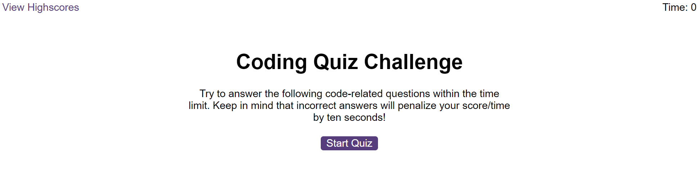

# Coding Quiz App

## Table of Contents

- [Introduction](#introduction)
- [Features](#features)
- [Usage](#usage)
- [Technologies](#technologies)
- [Contributing](#contributing)
- [License](#license)

## Introduction

The Coding Quiz App is a web-based quiz application designed to test your knowledge of JavaScript fundamentals. It provides a timed quiz with multiple-choice questions and tracks your score. Users can attempt to answer questions within a time limit, and their final score is displayed at the end of the quiz. High scores can be saved for comparison with peers.

## Features

- Multiple-choice questions on JavaScript fundamentals.
- Timed quiz with a countdown timer.
- Penalty for incorrect answers (time deduction).
- High score tracking.
- User-friendly interface with feedback on correct and incorrect answers.

## Usage

1. **Live Demo**: Visit the [live demo](https://johngreek23.github.io/Challenge6/)) to use the app online.
2. Click the "Start Quiz" button to begin the quiz.
3. Answer each question by clicking the appropriate choice.
4. If you answer correctly, you will receive positive feedback. If you answer incorrectly, time will be deducted from the countdown timer.
5. The quiz ends when you complete all questions or when the timer reaches 0.
6. After completing the quiz, you can enter your initials and submit your score to save it.
7. View high scores to compare your performance with others.

## Screenshot

## Technologies

The Coding Quiz App is built using the following technologies:

- HTML
- CSS
- JavaScript

## Contributing

Contributions to the project are welcome! If you have any bug fixes, feature enhancements, or suggestions, please submit a pull request. For major changes, please open an issue to discuss the proposed changes.

## License

This project is licensed under the [MIT License](LICENSE).

